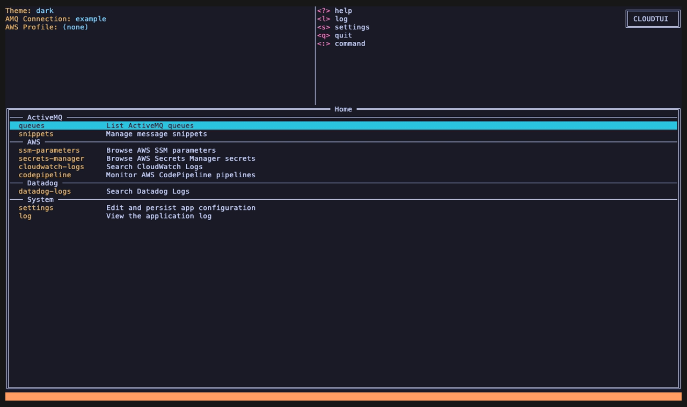
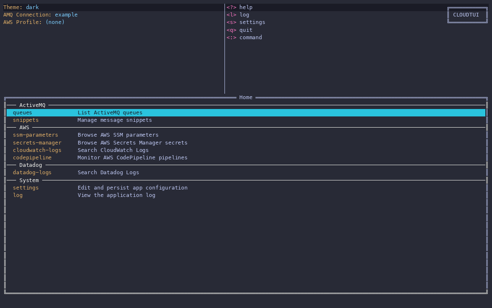
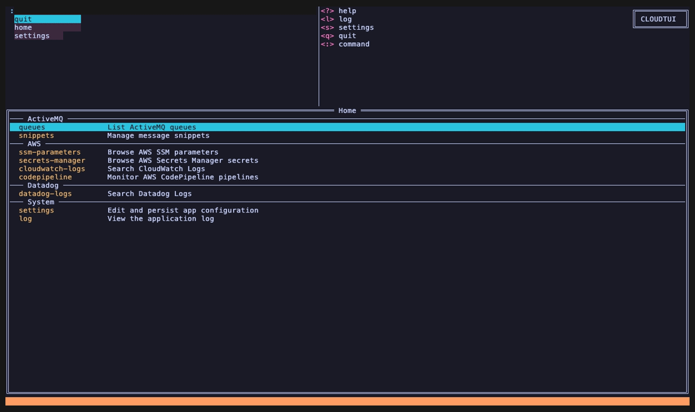

# cloudtui

A terminal UI for managing cloud resources.

## Features

**ActiveMQ**

- **Queues:** pending, consumer and enqueue/dequeue counts, with a live
  filter and sorting by any column. A setting hides queues with no
  pending messages.
- **Messages:** browse a queue's messages, search them, filter by JMS
  Type and time range, and open a message to see its headers,
  properties and (pretty-printed) body. `c` copies it to the clipboard.
- **Actions:**
  - purge a queue, optionally only one JMS Type
  - delete or move messages one at a time, marked, or all at once
  - send new messages with JMS Type, correlation and group IDs, and
    custom headers

  When moving out of a `dlq.*` queue, the matching queue is offered
  first, so requeuing a dead-letter queue takes a couple of keys.
- **Message snippets:** a library of reusable messages, stored as plain
  files you can share. Save a received message as a snippet, load one
  into the send dialog, manage folders and snippets in the app, or import
  a JSON/XML file from anywhere (see [Message snippets](#message-snippets)).
- **Connections:** switch between named broker connections, using Jolokia
  or, for Amazon MQ (which has no Jolokia), the bundled `mq-proxy`
  service. A connection's password can come from AWS Secrets Manager.
- **A web console** (`mq-console.html` on each release) offers the same
  queue operations in a browser, for colleagues who don't use a terminal.

**AWS** (using your AWS CLI profiles, with SSO re-login when a session
expires)

- **Parameter Store** and **Secrets Manager:** browse, reveal values, and
  star favorites.
- **CloudWatch Logs:** search a log group over a relative or absolute
  time range.
- **CodePipeline:** watch pipelines and get desktop notifications as
  their stages change.

**Datadog**

- **Logs:** search with service/env filters. Jump from a Datadog log line
  to the matching CloudWatch log by its correlation ID.

**Everywhere**

- Keyboard-driven, with a `:` command prompt (with autocomplete) to
  switch views.
- Themes you can switch live, plus your own color overrides.

### A quick look

These recordings run against an example broker holding only made-up
data; [`docs/demo/`](docs/demo/) has the scripts that build it and
record them.

Browse queues, a queue's messages, and a message's details:



Requeue a dead-letter queue: mark all, move, and the matching queue is
offered first:



Send a message from a snippet:


The snippet library: preview, then import a plain JSON file and give it
a JMS Type:



Switch themes live:


## Installing a release

**macOS/Linux:**

```
curl -fsSL https://raw.githubusercontent.com/ePex/cloudtui/main/scripts/install.sh | sh
```

**Windows (PowerShell):**

```
irm https://raw.githubusercontent.com/ePex/cloudtui/main/scripts/install.ps1 | iex
```

Both scripts install to a per-user directory (no `sudo`/admin rights
needed) and verify the download's checksum before installing. Pin a
specific version with the `CLOUDTUI_VERSION` environment variable
(default: latest).

**Homebrew (macOS/Linux):**

```
brew install --cask ePex/tap/cloudtui
```

Upgrade later with `brew upgrade --cask cloudtui`.

**Scoop (Windows):**

```
scoop bucket add ePex https://github.com/ePex/scoop-bucket
scoop install cloudtui
```

Upgrade later with `scoop update cloudtui`.

**Go toolchain installed?**

```
go install github.com/ePex/cloudtui/tui/cmd/cloudtui@latest
```

Prefer to pick the archive yourself? Download it for your OS/architecture from the
[Releases](https://github.com/ePex/cloudtui/releases) page
(`cloudtui_<version>_<os>_<arch>.tar.gz`, or `.zip` on Windows), extract
it, and run the `cloudtui` binary inside. `checksums.txt` on the same
release lets you verify the download. Prebuilt for linux/darwin/windows
on amd64/arm64.

Prefer to build from source instead? See "Usage" below.

## Usage

```
task run:tui
```

Press `:q` to quit.

On a message detail page, press `c` to copy the queue name, message
summary, displayed headers and properties, and full body to the clipboard.

## Message snippets

Snippets are reusable ActiveMQ messages: a body plus an optional JMS
Type, kept as plain files so you can edit them anywhere and share them
with others.

**Where they live:** `~/.cloudtui/snippets/` (on Windows,
`%USERPROFILE%\.cloudtui\snippets\`). Subfolders are fine, and every
file in the tree is a snippet, whatever its extension. Names starting
with `.` are ignored, so a `.git` folder doesn't get in the way.

**File format:** an optional YAML header between `---` lines, then the
message body exactly as it will be sent:

```
---
jmsType: OrderCreated
---
{
  "orderId": "ORD-1001",
  "customerId": "CUST-42"
}
```

- `jmsType` is the only key cloudtui uses. Any other keys and comments
  you add (e.g. `author:`) are kept when you edit the snippet in the app.
- Without a header, the whole file is the body and there's no JMS Type.
  Any text file works as is.
- The body can be anything textual: JSON, XML, plain text, ...
- Valid JSON is saved with two-space indentation. Valid XML is indented
  when formatting can preserve its text; mixed-content XML, XML using
  `xml:space="preserve"`, malformed JSON/XML, and other text are left as
  written.

**Using snippets in the app:**

- **Save a message as a snippet:** open a message and press `S`. Only
  the body and the JMS Type are saved; other headers aren't.
- **Send a snippet:** on a queue, press `c` to create a message, then
  **Load snippet…**. It fills in JMS Type and Body, asking first if you
  already typed something there; everything else in the dialog stays as
  it is.
- **Manage the library:** open **snippets** from Home (under ActiveMQ)
  or type `:snippets`. A preview of the selected snippet is shown on the
  right. Valid JSON/XML is formatted in the preview without changing the
  file. Opening a snippet for editing also formats and saves its body.

  | Key | Action |
  |---|---|
  | Enter | open a folder, or edit a snippet |
  | `n` / `N` | new snippet / new folder |
  | `i` | import a file from anywhere on disk |
  | `e` | edit |
  | `R` | rename or move (edit the path) |
  | `d` | delete (asks first) |
  | `r` | re-read the folder from disk |
  | Backspace | up a folder |

**Importing a file:** in the Snippets view, press `i` and enter the
file's absolute path. You can paste it, or drag the file into the
terminal; quotes, `\ ` escapes and `~` are handled. Then confirm or
change the name it gets in the current folder. The file must be text
and at most 1 MiB. It's saved like any snippet, so JSON/XML is
formatted, and the original file is left untouched. Import never
overwrites an existing snippet. A plain file (e.g. a JSON message) has
no JMS Type yet, so the editor opens on that field right away. Type it
and press Enter.

**Examples:** [`examples/snippets/`](examples/snippets/) has a few
generic ones (JSON, XML, plain text, one with extra header keys) to
start from. Copy them into your library:

```sh
# macOS / Linux
mkdir -p ~/.cloudtui/snippets && cp -R examples/snippets/. ~/.cloudtui/snippets/
```

```powershell
# Windows (PowerShell)
New-Item -ItemType Directory -Force "$HOME\.cloudtui\snippets" | Out-Null
Copy-Item -Recurse -Force examples\snippets\* "$HOME\.cloudtui\snippets\"
```

**Sharing:** copy the folder, or keep it in a git repository. You can
also link a shared checkout into the library (e.g.
`ln -s ~/team-snippets ~/.cloudtui/snippets/team`). Deleting a linked
folder in the app removes only the link, never the shared files.

## Status

Early development. See `CLAUDE.md` for repository conventions.

## License

[MIT](LICENSE)
